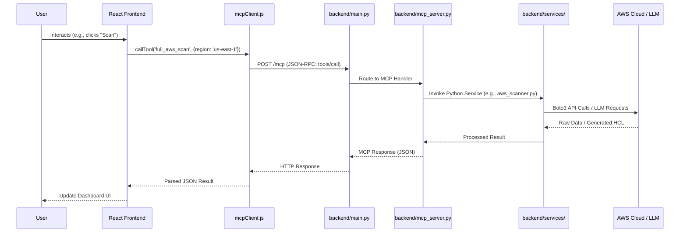

# Application Flow Analysis — Agentic Cloud Assistant (ACA)

This document outlines how data and requests flow through the ACA application, from the user interface to the cloud infrastructure and back.

## 1. High-Level Architecture

The application follows a client-server architecture with a specific focus on the **Model Context Protocol (MCP)** for communication.

- **Frontend**: React-based Single Page Application (SPA).
- **Backend**: FastAPI (Python) serving as an MCP Host and REST API.
- **Communication**: JSON-RPC over HTTP POST (MCP Protocol).
- **External Integrations**: AWS SDK (Boto3), Terraform CLI, and LLM Providers (Anthropic, Groq, Ollama).

---

## 2. Request Flow: From UI to Infrastructure

The following diagram illustrates the lifecycle of a request:

---

## 3. Core Components Detail

### A. Frontend: The MCP Client
Located in `frontend/src/api/mcpClient.js`, this module acts as the bridge.
- **Initialization**: Negotiates protocol version and capabilities with the server.
- **`callTool(name, args)`**: The primary interface for components. It abstracts the JSON-RPC complexity.
- **Transport**: Uses standard `fetch` with `Mcp-Session-Id` headers to maintain stateful interactions if required by the server.

### B. Backend: The MCP Host
Located in `backend/main.py` and `backend/mcp_server.py`.
- **`main.py`**:
    - Mounts the `FastMCP` app at `/mcp`.
    - Uses `docs_generator.py` to auto-expose MCP tools as standard REST endpoints for documentation (Swagger).
- **`mcp_server.py`**:
    - Defines **Tools**: Functions decorated with `@mcp.tool()` are automatically discoverable by the frontend and LLMs.
    - Examples: `full_aws_scan`, `generate_terraform_from_request`, `agent_run`.

### C. Services Layer: Business Logic
Located in `backend/services/`.
- **`aws_scanner.py`**: Interacts with AWS using Boto3 to fetch resource states (EC2, S3, VPC, etc.).
- **`terraform_service.py`**: Handles HCL generation using LLMs and syntax validation via the Terraform CLI.
- **`execution_service.py`**: Manages the `terraform plan/apply` lifecycle, including logging and human-in-the-loop approvals.
- **`llm_service.py`**: Provides a unified interface for multiple LLM providers (Anthropic, Groq, Ollama).
- **`security_analyzer.py`**: Applies custom logic rules to raw AWS scan data to find vulnerabilities.

---

## 4. Specific Flow Example: Security Remediation Agent

When a user triggers the "Autonomous Agent":

1.  **Trigger**: Frontend calls `agent_run`.
2.  **Scanning**: `mcp_server.py` calls `aws_scanner.py` for a full audit.
3.  **Analysis**: `security_analyzer.py` flags the highest-priority issue (e.g., an open SSH port).
4.  **Generation**: `llm_service.py` generates Terraform HCL to close the port.
5.  **Planning**: `execution_service.py` runs `terraform plan` and saves the state with a unique `execution_id`.
6.  **Human Review**: The backend returns the plan summary and `execution_id` to the frontend.
7.  **Approval**: If the user clicks "Approve", the frontend calls `run_terraform_apply_mcp(execution_id, approved=True)`.
8.  **Execution**: The backend runs `terraform apply`, updates the AWS infrastructure, and logs the result.

---

## 5. Security & State
- **Credentials**: AWS credentials and API keys are typically pulled from backend `.env` files, but the frontend can override them by passing arguments to tool calls.
- **Execution Logs**: Past actions are persisted in `backend/execution_log.json` and can be retrieved via `get_execution_history_tool`.
- **Terraform Workspace**: Each execution happens in a unique subdirectory under `backend/terraform_workdirs/` to ensure isolation.
